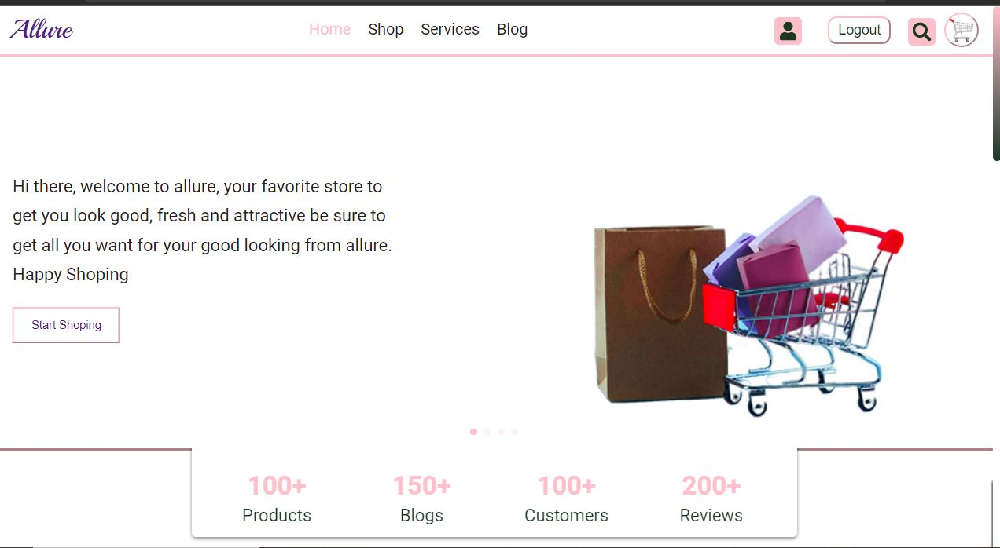
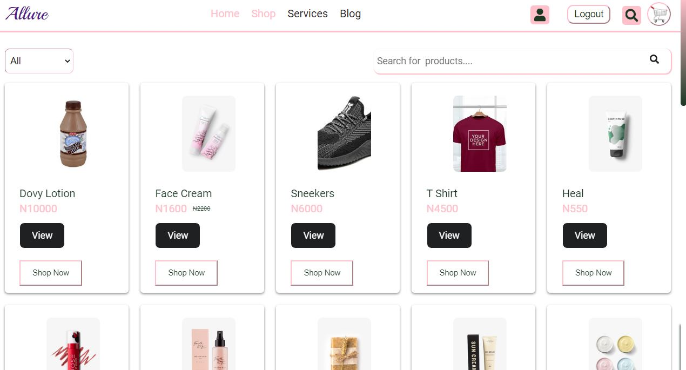
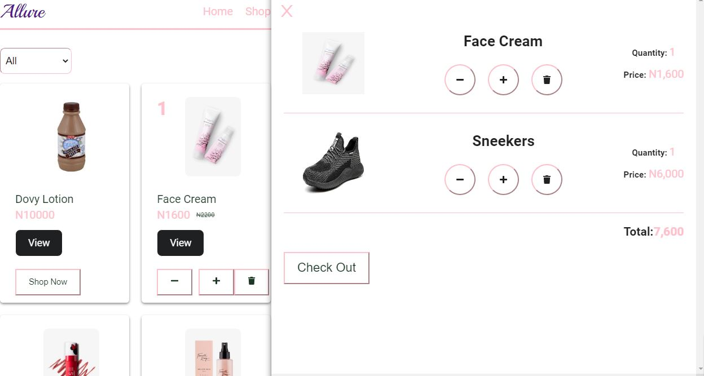
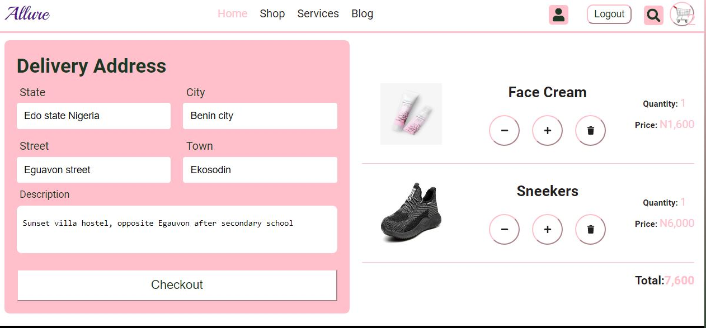
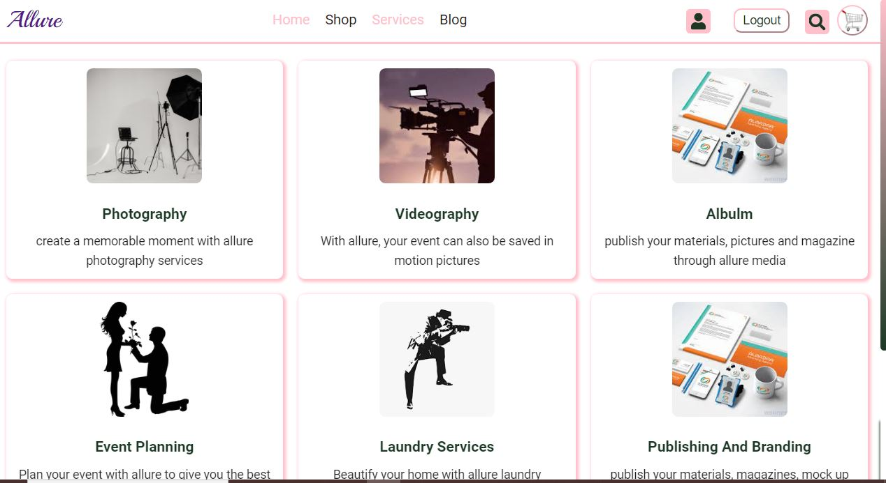

# Allure - E commerce web store incoperated with Extra functionalities

## this project is an E commerce web store with extra functionalities such as User profile section, Blog, Services Booking section. Through the user profile section, users are able to manage their purchased product, the services they have booked, set up a default delivery address and configure some basic settings

## I really enjoyed this project as I learnt so many things and improve on my coding game. I will keep modifiying this project and its opened for contribution, assessment and corrections. Let's take a quick tour on the project

### Home page

## Products page

## Cart Section

## Ckeckout page

## Services page

## Blog page

## Sign Up page

